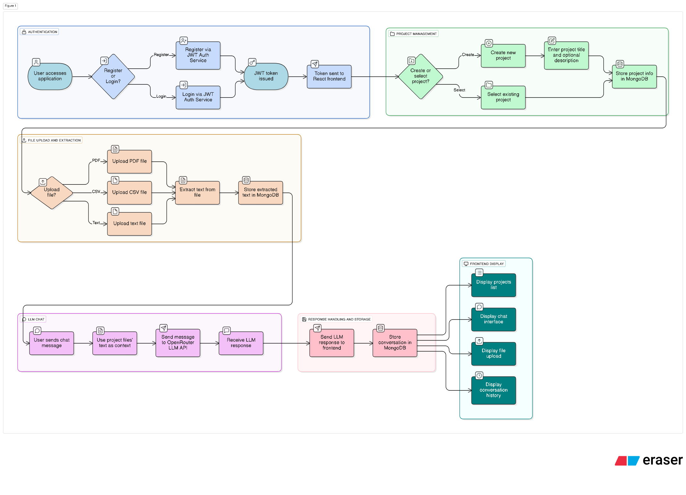
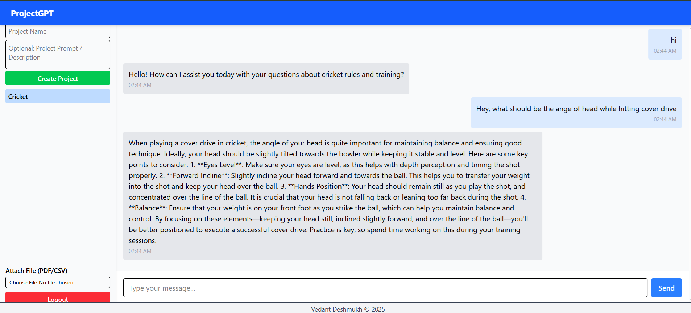
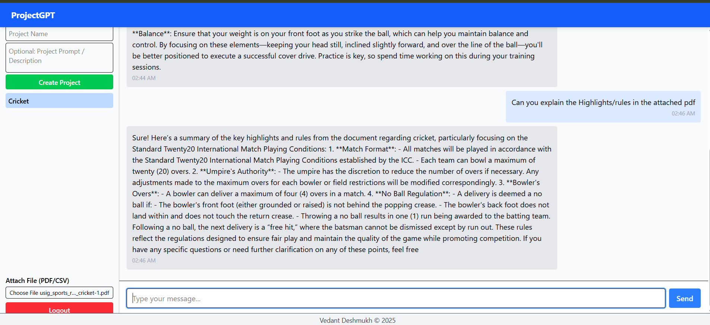

# ProjectGPT - Minimal Chatbot Platform 🤖

A minimal chatbot platform built using the **MERN stack**, supporting multiple users, projects/agents, file uploads, and chat interaction using **OpenRouter LLM API**.

### 🚀 Live Demo

[Click here to try the deployed app](https://yellow-frontend.vercel.app)

---

## Features

- **User Authentication:** JWT-based user registration and login.
- **User Accounts:** Create and manage multiple users.
- **Projects / Agents:** Users can create projects with a title and optional prompt/description.
- **Chat Interface:** Interact with each project/agent using OpenRouter API.
- **File Upload:** Upload PDF/CSV files to a project (text extraction for AI queries).
- **Chat History:** Each project maintains its own chat history.
- **Responsive Frontend:** React-based chat interface with mobile-friendly layout.

---

## Architecture



### Screenshots

- Project creation: 
- File upload & explanation by ProjectGPT: 

### Explanation

- **Frontend:** React.js handles UI, chat, and project management.
- **Backend:** Node.js + Express handles authentication, project management, chat routing, and file uploads.
- **Database:** MongoDB stores users, projects, chat history, and uploaded file metadata.
- **LLM API:** OpenRouter API generates AI responses per project.
- **File Extraction:** Uploaded PDF/CSV files are parsed to provide context to AI.

---

## Tech Stack

- **Frontend:** React.js, TailwindCSS
- **Backend:** Node.js, Express.js
- **Database:** MongoDB
- **Authentication:** JWT
- **LLM Integration:** OpenRouter API
- **File Processing:** PDF/CSV text extraction

---

## Getting Started

### Prerequisites

- Node.js v18+
- MongoDB
- OpenRouter API key

### Installation

```bash
# Clone repository
git clone https://github.com/yourusername/projectgpt.git
cd projectgpt

# Install backend dependencies
cd backend
npm install

# Install frontend dependencies
cd ../frontend
npm install
```

### Environment Variables

Create a `.env` file in the `backend` folder:

```
PORT=4000
MONGO_URI=your_mongodb_uri
JWT_SECRET=your_jwt_secret
OPENROUTER_API_KEY=your_openrouter_api_key
```

### Running the Application

```bash
# Start backend
cd backend
npm run dev

# Start frontend
cd ../frontend
npm run dev
```

Visit `http://localhost:5173` (or the port shown by Vite) in your browser.

---

## Usage

1. Register a new user or login with existing credentials.
2. Create a new project/agent with a title and optional prompt/description.
3. Upload PDF/CSV files to provide additional context.
4. Use the chat interface to ask questions or interact with AI.
5. Chat history is automatically stored per project.

---

## Folder Structure

```
projectgpt/
├─ backend/       # Node.js + Express backend
├─ frontend/      # React frontend
├─ public/        # Static assets (favicon, images)
└─ README.md
```

---

## Future Improvements

- Analytics dashboard for user and project activity.
- Multi-language support for chat and PDF parsing.
- File embedding & semantic search for large documents.
- Role-based access control for teams.

---

Vedant Deshmukh © 2025
